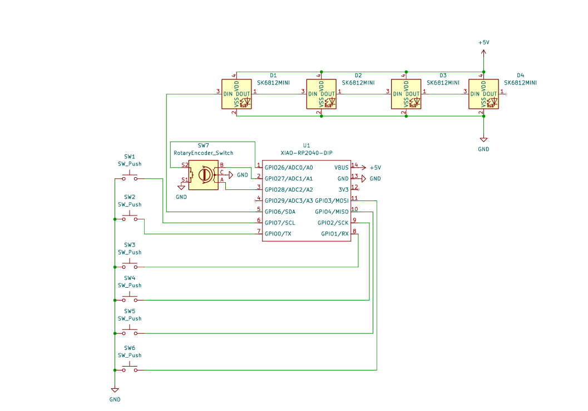
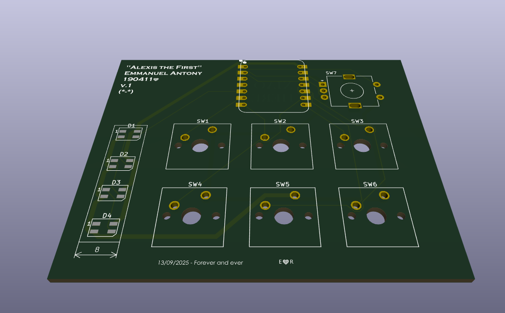
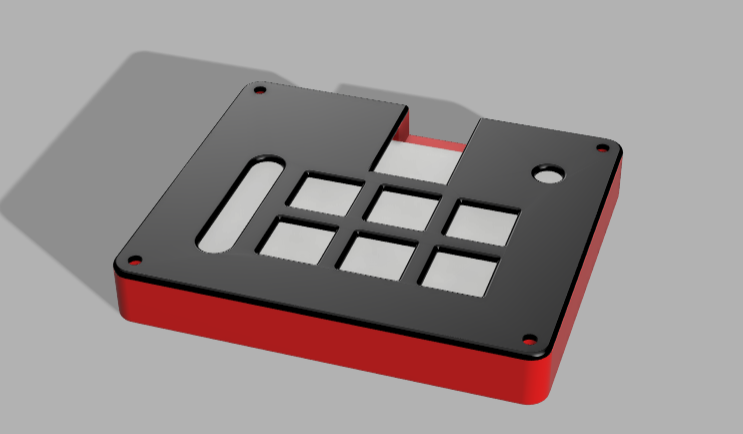

# Alexis the First

### Inspiration
I wanted to create a macropad that could help me access shortcuts I use commonly more easily. To assist with that, I added 6 keys, a rotary encoder, and some RGB for fun.

### Challenges
This was my first time using KiCad, and I had some fun figuring out how to properly use it.

### Specifications

#### BOM:
- 6x Cherry MX Switches
- 4x SK6812 MINI LEDs
- 1x Seeed XIAO RP2040
- 1x EC11 Rotary Encoder
- 6x Blank DSA Keycaps
- 4x M3x16 Bolts
- 4x M3 Heatset Inserts

#### Other Files:
- KMK Firmware (`Firmware/main.py`)
- Top Plate (`CAD/top_plate.3MF`)
- Bottom Plate (`CAD/bottom_plate.3MF`)
- Full Model Mockup (`CAD/Alexis_the_first_full.STEP`)

---

### Screenshots

| Schematic | PCB | Case |
|:---------:|:---:|:----:|
|  |  |  |

---

### Notes
- All design files are organized in their respective folders: `CAD/`, `PCB/`, `Firmware/`.
- The project uses only approved parts and fits within the required dimensions.
